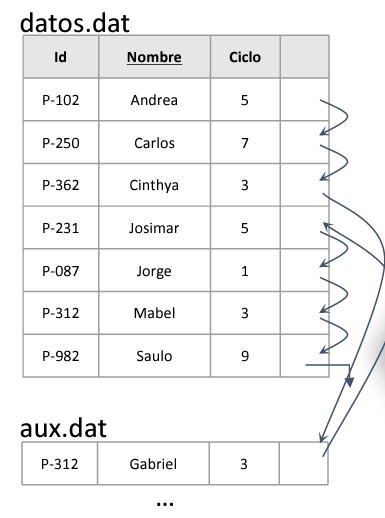
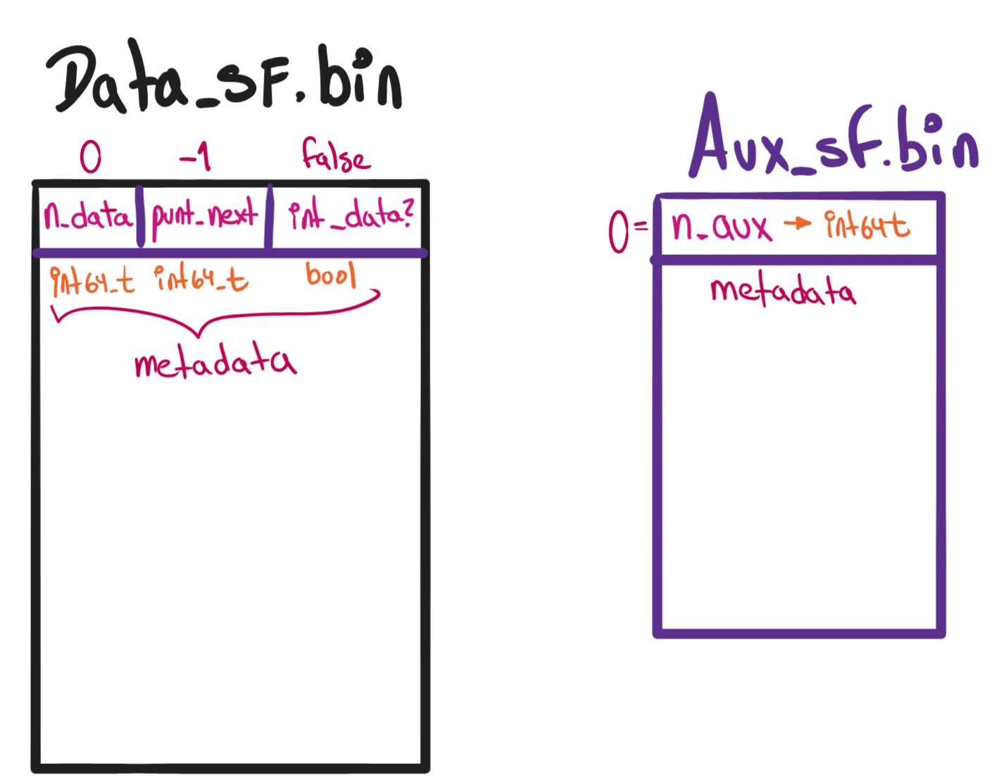
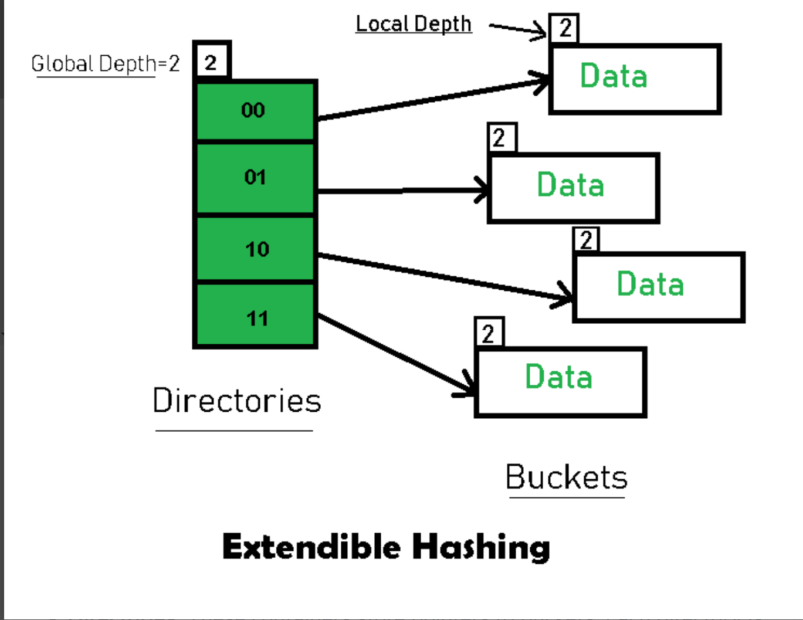
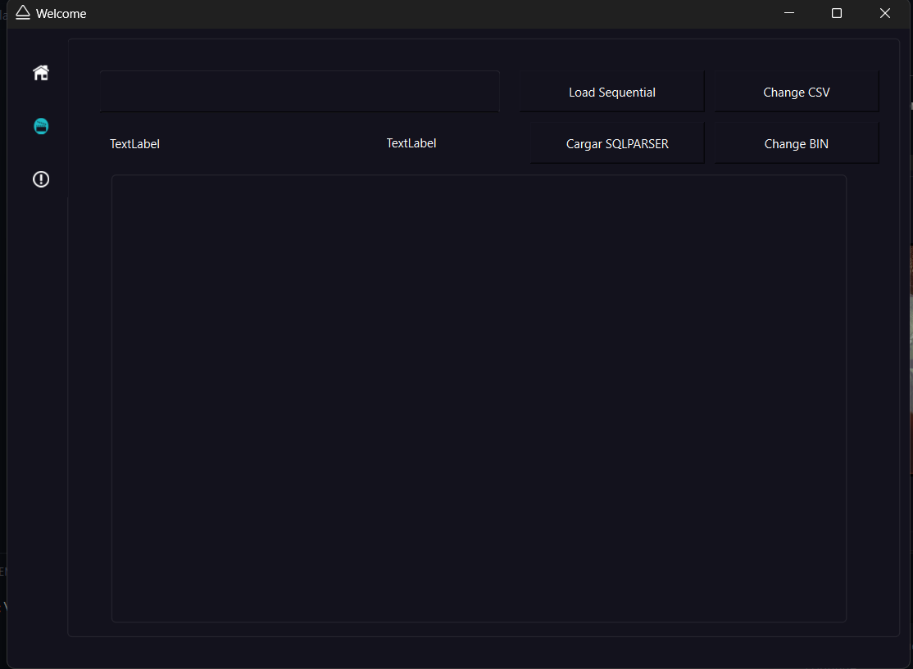
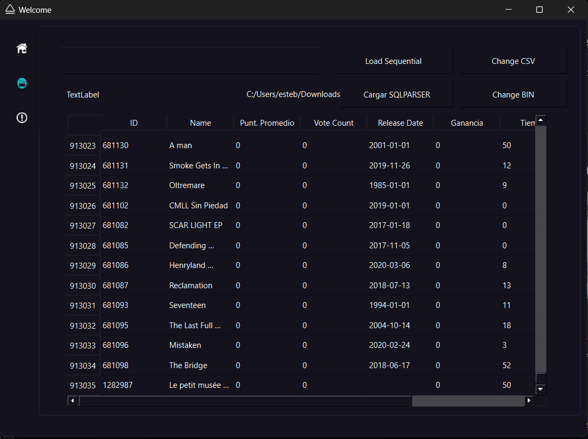

# Proyecto 1-BD2: Organización de Archivos
- [Introducción](#introducción)
  - [Objetivos](#objetivos)
    - [Principal](#principal)
    - [Secundarios](#secundario)
  - [Dataset](#dataset)
    - [Generación de registros en binario](#generación-de-registros-en-binario)
- [Técnicas de indexación](#tecnicas-de-indexación)
  - [Sequential File](#sequential-file)
    - [Elementos de ayuda](#elementos-de-ayuda)
      - [Estrutura Hija de Record: *Record_SFile*](#estrutura-hija-de-record-record_sfile)
      - [Variables globales](#variables-globales)
    - [`Class Sequential_File`: Constructor](#class-sequential_file-constructor)
    - [`Class Sequential_File`: Funciones privadas](#class-sequential_file-funciones-privadas)
    - [`Class Sequential_File`: Funciones públicas](#class-sequential_file-funciones-públicas)
    - [Código de prueba](#código-de-prueba)
    - [Análisis de complejidad](#análisis-de-complejidad)
  - [ISAM](#isam)
    - [Elementos de ayuda](#elementos-de-ayuda-1)
      - [Estructura de la metadata: *Metadata_ISAM*](#estructura-de-la-metadata-metadata_isam)
      - [Variables globales](#variables-globales-1)
    - [`Class ISAM`: Constructor](#class-isam-constructor)
    - [`Class ISAM`: Funciones privadas](#class-isam-funciones-privadas)
    - [`Class ISAM`: Funciones públicas](#class-isam-funciones-públicas)
      - [`void add(Record record) - O(log(n)) + O(log(n))`](#void-addrecord-record---ologn--ologn)
      - [`void reBuild(fstream&, fstream&) - O(n)`](#void-rebuildfstream-fstream--on-1)
      - [`void search(string key) - O(log(n))`](#void-searchstring-key---ologn-1)
      - [`vector<Record> range_search(string key, string key2) - O(log(n))`](#vectorrecord-range_searchstring-key-string-key2---ologn)
     
  - [Extendible Hashing](#extendible-hashing)
    - [Elementos de ayuda](#elementos-de-ayuda-2)
      - [Estructura de la metadata: *Metadata_EH*](#estructura-de-la-metadata-metadata_eh)
      - [Variables globales](#variables-globales-2)
    - [`Class Extendible_Hashing`: Constructor](#class-extendible_hashing-constructor)
    - [`Class Extendible_Hashing`: Funciones privadas](#class-extendible_hashing-funciones-privadas)
    - [`Class Extendible_Hashing`: Funciones públicas](#class-extendible_hashing-funciones-públicas)
      - [`void add(Record record) -
  - [Pruebas de uso y presentación](#Pruebas-de-uso-y-presentación)
- [Autores](#autores)

# Introducción
De lo aprendido implementaremos técnicas de organización de archivos involucrando un manejo eficiente de la memoria secundaria.
## Objetivos
### Principal
- Desarrollar e implementar en C++ las siguientes estructuras de indexación: Sequential File, ISAM, y Extendible Hashing; junto a sus operaciones completas de búsqueda, inserción, eliminación y búsqueda por rango. 
Además, debe haber un manejo eficiente de la memoria secundaria, ya que es muy costosa.

### Secundarios
- Implementar un parser y un GUI con QT para simular un SDGB.
- Analizar el comportamiento computacional de cada técnica y sus funciones implementadas.
- Identificar las ventajas y desventajas de cada técnica de organización.

## Dataset
Usamos un dataset publicado en **[Kagle](https://www.kaggle.com/datasets/asaniczka/tmdb-movies-dataset-2023-930k-movies/data)** por TMDB(The Movie Database), una base de datos en línea dedicada a la información sobre películas.

Elegimos este dataset ya que contiene alrededor de 1 000 000 de registros y 24 atributos. Sin embargo, para el correcto funcionamiento de nuestros algoritmos y la integridad de nuestro proyecto hemos hecho las siguientes modificaciones con ayuda de un script en Python:
- **Eliminación de las películas para adultos**: Eliminamos todos los registros cuyo atributo booleano *adult* era `true`. Estas películas representaban el 9% del total de registros.
- **Eliminación de caracteres especiales**: Eliminamos los caracteres especiales de los atributos *title*, que generaban problemas en la lectura e impresión de los datos. Fue un trabajo manual y de prueba-error, ya que algunos caracteres especiales no se eliminaban correctamente con el script y otros no generaban problemas.

>Todo este proceso de limpieza nos dejó con un total de **913035** registros.

También hemos eliminado algunos atributos que no consideramos relevantes para nuestro proyecto, y nos quedamos con *8* atributos:
 ```c++
 struct Record{
    int64_t id{};
    char name[71]{};
    float punt_promedio{};
    int64_t vote_count{};
    char release_date[11]{};
    int64_t ganancia{};
    int64_t tiempo{};
    char lang[3]{};
 }
 ```
|    **Campo**    |                            **Descripción**                                          | 
|:---------------:|:-----------------------------------------------------------------------------------:|
| ```id```        | Identificador único para cada película.             |  
| ```name```  | Título de la película respectiva. | 
| ```punt_promedio``` | Puntaje promedio de la película [0-10]. |
| ```vote_count``` | Recuento total de votos recibidos para la película.|
| ```release_date``` | Fecha en que se estrenó la película. |
| ```ganancia``` | Ingresos totales generados por la película. |
| ```tiempo``` | Duración de la película en minutos |
| ```lang``` | Idioma original(abreviatura) en el que se produjo la película. |

### Generación de registros en binario
Para la generación de registros en binario, en el archivo [`data.h`](https://github.com/IsaacVera10/DB2_project1/blob/main/dataset/data.h) de la carpeta [**dataset**](https://github.com/IsaacVera10/DB2_project1/tree/main/dataset) se encuentra la función `records_csv_to_bin(const string&, int64_t)`, que con ayuda de la librería construida en [`csv.hpp`](https://github.com/IsaacVera10/DB2_project1/blob/main/dataset/csv.hpp), se encarga de leer el archivo .csv y escribir los registros en un archivo binario.
  
  ```c++
  void records_csv_to_bin(const string& route_file, int64_t count = -1){
    Record record;
    try {
        csv::CSVFormat format;
        format.delimiter(',');
        format.quote('"');
        format.header_row(0);

        csv::CSVReader reader("./"+route_file, format);

        fstream file("./dataset/movie_dataset.bin", ios::binary | ios::out | ios::trunc);
        if(!file.is_open()) throw runtime_error("Error al abrir el archivo");
        for(auto& row : reader){
            if(count>0) count --;
            else if(count == 0) break;
            
            record.id = row["id"].get<int64_t>();
            strcpy(record.name, row["title"].get<string>().c_str());
            record.punt_promedio = row["vote_average"].get<float>();
            record.vote_count = row["vote_count"].get<int64_t>();
            strcpy(record.release_date, row["release_date"].get<string>().c_str());
            record.ganancia = row["revenue"].get<int64_t>();
            record.tiempo = row["runtime"].get<int64_t>();
            strcpy(record.lang, row["original_language"].get<string>().c_str());
            file.write(reinterpret_cast<char*>(&record), sizeof(Record));
        }
        file.close();
    }
    catch(exception& e){
        cerr<<"\nError: "<<e.what()<<endl;
    }

}
```
En el archivo `movie_dataset.bin` se encontrán los registros en binario, listos para ser leídos por nuestros algoritmos de indexación.


# Técnicas de indexación
## Sequential File
Esta técnica de organización se caracteriza, principalmente, por su forma de organizar y almacenar los registros en un archivo de forma secuencial, es decir, uno detrás de otro. Cada record tiene un puntero que apunta al siguiente registro (***posición lógica***), y el último registro apunta a un valor nulo.

<div style="text-align: center;">
    
</div>


>**Implementación**: Para la implementación de esta técnica, hemos elegido la ***Estrategia 1*** planteada en clases, que se refiere al uso de dos archivos: uno llamado  `data.bin` que contiene los registros ordenados por el *key* y otro llamado `aux.bin` que es el archivo donde insertaremos los registros nuevos como un Heap File pero estarán ordenados por sus respectivos punteros.


### Elementos de ayuda
Para la implementación del sequential file, nos ayudamos de algunos elementos que facilitan la manipulación e implementación de las funciones de búsqueda, inserción, eliminación y búsqueda por rango.

#### Estrutura Hija de Record: *Record_SFile*
Cuando indexemos los registros con esta estructura, cada registro necesitará de un puntero que apunte a la siguiente posición lógica en el archivo. Para esto, creamos una estructura hija de `Record` que contenga estos elementos extras.
```c++
struct Record_SFile : public Record {
    int64_t punt_nextPosLogic = -1; // 8 bits
    bool punt_next_is_In_Data = false; // 1 bit
    
    Record_SFile(int64_t id, const char* name, float punt_promedio, int64_t vote_count, const char* release_date, int64_t ganancia, int64_t tiempo, const char* lang)
        : Record(id, name, punt_promedio, vote_count, release_date, ganancia, tiempo, lang) {}
    ...
};
```
#### Variables globales
Hemos hecho uso de vairables globales para evitar la creación constante de diversas variables en las funciones a implementar. Estas variables se encuentran encapsuladas en un *namespace* llamado `var_temps_SF`, algunas de las importantes son:
 - `punt_pos`: De tipo `int64_t`, almacenará la posición lógica de un regitro.
 - `punt_is_in_data`: De tipo `bool`, indicará si el registro de la posición lógica `punt_pos` se encuentra en el archivo `data.bin` o no(en `aux.bin`).
 - `u_before`: De tipo `int64_t`, si es que el registro a *insertar* no existe, almacenará la posición lógica del que debería ser su antecesor. También ayudará en las funciones *search* y *range_search*.

 - `u_before_is_in_data`: De tipo `bool`, indicará si el registro de la posición lógica `u_before` se encuentra en el archivo `data.bin` o no(en `aux.bin`).
 - `rec_temp`: De tipo `Record_SFile`, almacenará temporalmente un registro para realizar operaciones con él.

### `Class Sequential_File`: Constructor
El constructor de la clase `Sequential_File` se encarga de abrir los archivos `data.bin` y `aux.bin` en modo binario y lectura/escritura. Si no existen, los crea.

Además, se encarga de escribir la metadata de cada archivo:
- **`data.bin`**: Su metadata contiene 3 datos:
  * `int64_t n_data`: Cantidad de registros en el archivo.
  * `int64_t punt_pos`: Posición lógica del primer registro.
  * `bool punt_is_in_data`: Si el registro que apunta está en `data.bin` o no(`aux.bin`).
- **`aux.bin`**: Su metadata contiene solo 1 dato:
  * `int64_t n_aux`: Cantidad de registros en el archivo.
>Recoceremos al record final cuando `punt_nextPosLogic` sea -1 y `punt_next_is_In_Data` sea `false`.
<div style="text-align: center;">
    
</div>


### `Class Sequential_File`: Funciones privadas
Implementamos algunas funciones privadas que nos ayudarán a realizar código recurrente en las funciones públicas de la clase `Sequential_File`.
####
- **`int64_t get_pos_logical(int64_t, bool)`**: Dado un valor de tipo `int64_t`(posición física) y un valor de tipo `bool`(si el registro está en `data.bin` o no), nos devolverá la posición lógica del registro en el archivo.
- **`int64_t get_pos_fisica(int64_t, bool)`**: Dado un valor de tipo int64_t(posición lógica) y un valor de tipo bool(si el registro está en data.bin o no), nos devolverá la posición física del registro en el archivo.
- **`bool binary_search(int64_t key)`**: Realiza una búsqueda binaria en el archivo `data.bin` para encontrar un registro con un *key* específico. 
  * Si no lo encuentra, nos devolverá `false` y la variable `u_before` almacenará la posición lógica del registro que debería ser su antecesor. `u_before` será -1 si el registro a buscar es menor que el primer registro.
  * Si lo encuentra, nos devolverá `true` y la variable `punt_pos` almacenará la posición lógica del registro.

- **`get_u_before(int64_t, fstream&, fstream&)`**: Dado un valor de tipo `int64_t` que es la **key** de un registro, nos devolverá la posición lógica del registro que debería ser su antecesor almacenado en la variable global `u_before` y `u_before_is_in_data` dicho registro se encuentra en `data.bin` o no. 
Esta función solo funcionará en las siguiente funciones:
  * `insert(Record_SFile&)`: El record que se quiere insertar no existe.
  * `range_search(int64_t, int64_t)`: No nos interesa si el registro existe o no, solo queremos obtener los records límites:
    - Si el key límite inferior o superior existen, la **búsqueda binaria** seteará a `u_before` al record encontrado, si no existe, `u_before` será el record que debería ser su antecesor.
### `Class Sequential_File`: Funciones públicas
#### `void add(Record record_sf)`
Inserta un registro en el archivo `aux.bin` de forma ordenada por su *key*. Si el registro ya existe, no lo inserta. El **reto** de esta función es mantener la integridad de los punteros de los registros, ya que si insertamos un registro en medio de dos registros existentes, debemos actualizar los punteros de los registros adyacentes.

```c++
...
    file1.seekg(0, ios::beg);
    file2.seekg(0, ios::beg);

    //Seteo los valores de las variables temporales - data.bin
    file1.read(reinterpret_cast<char*>(&var_temps_SF::n_data), sizeof(var_temps_SF::n_data));
    file1.read(reinterpret_cast<char*>(&var_temps_SF::punt_pos), sizeof(var_temps_SF::punt_pos));
    file1.read(reinterpret_cast<char*>(&var_temps_SF::punt_is_in_data), sizeof(var_temps_SF::punt_is_in_data));
    
    //Seteo los valores de las variables temporales - aux.bin
    file2.read(reinterpret_cast<char*>(&var_temps_SF::n_aux), sizeof(var_temps_SF::n_aux));
...
```

Para el correcto manejo de los punteros, presentamos 3 casos:
- **Caso 1 - No hay registros:** Esto sucede cuando `n_data` es 0. Nos vamos al final del archivo `data.bin`, actualizamos el puntero del archivo `data.bin` con la posición lógica(obtenida de la posición física del puntero de escritura) y escribimos el registro en el archivo `aux.bin`.

  ```c++
      if(var_temps_SF::n_data==0){
          file1.seekp(0, ios::end);
          
          //Actualizamos la metadata
          var_temps_SF::n_data++;
          var_temps_SF::punt_pos = get_pos_logical(file1.tellp(), true);
          var_temps_SF::punt_is_in_data = true;

          //Escribimos el registro
          file1.write(reinterpret_cast<const char*>(&record), sizeof(record));

          //Actualizamos la metadata
          file1.seekp(0, ios::beg);
          file1.write(reinterpret_cast<const char*>(&var_temps_SF::n_data), sizeof(var_temps_SF::n_data));
          file1.write(reinterpret_cast<const char*>(&var_temps_SF::punt_pos), sizeof(var_temps_SF::punt_pos));
          file1.write(reinterpret_cast<const char*>(&var_temps_SF::punt_is_in_data), sizeof(var_temps_SF::punt_is_in_data));
      }
  ```
- **Caso 2: Hay solo un registro:** Cuando `n_data` es 1, debemos comparar el *key* del registro a insertar con el *key* del registro existente. 
  - Si el *key* del registro a insertar es menor, lo insertamos antes del registro existente. Si es mayor, lo insertamos después del registro existente. Actualizamos los punteros de los registros adyacentes y escribimos el registro en el archivo `aux.bin`.

  ```c++
      if(record.key_value() < var_temps_SF::rec_temp.key_value()){//Si el registro a insertar es menor al primero, se inserta antes de este
          //Actualizamos la metadata del record a insertar
          record.punt_nextPosLogic = get_pos_logical(file1.tellp(), true);
          record.punt_next_is_In_Data = true;
          
          //Escribimos el registro
          file1.seekp(get_pos_fisica(var_temps_SF::punt_pos, true), ios::beg);
          file1.write(reinterpret_cast<const char*>(&record), sizeof(record));

          //Re-escribimos el record que estaba en data.bin
          file1.write(reinterpret_cast<const char*>(&var_temps_SF::rec_temp), sizeof(var_temps_SF::rec_temp));

      }else if(record.key_value() > var_temps_SF::rec_temp.key_value()){//Si el registro a insertar es mayor al primero, se inserta después de este
          var_temps_SF::rec_temp.punt_nextPosLogic = get_pos_logical(file1.tellp(), true);
          var_temps_SF::rec_temp.punt_next_is_In_Data = true;

          file1.seekp(get_pos_fisica(var_temps_SF::punt_pos, true), ios::beg);
          file1.write(reinterpret_cast<const char*>(&var_temps_SF::rec_temp), sizeof(var_temps_SF::rec_temp));

          file1.write(reinterpret_cast<const char*>(&record), sizeof(record));
      }else{
          throw runtime_error("El registro ya existe");
      }
  ```

- **Caso 3: Hay más de dos registros:** En este caso, ya debemos empezar a insertar registros en `aux.bin`. Pues **reconstruiremos** los archivos de manera ordenada siempre y cuando, la cantidad de registros en `aux.bin` sea piso de log2(n), siendo n la cantidad de registros en `data.bin`.

  * Con ayuda de la función `get_u_before(int64_t, fstream&, fstream&)`, obtenemos la posición lógica del registro que debería ser el antecesor del registro a insertar, ya sea que esté en `data.bin` o `aux.bin`. También nos señalará si el registro a insertar ya existe.

  * Actualizamos los punteros del registro ubicado en `u_before` y del registro a insertar.
    * Si `u_before` es -1, significa que el registro a insertar es menor que el primer registro.
      * Actualizamos los punteros del **registro a insertar** con el puntero de la metadata.
      * Actualizamos los punteros de la metadata de `data.bin` con la posición lógica del registro a insertar que será la posición de escritura al final del archivo `aux.bin`.

    * Si `u_before` es diferente de -1, hacemos la misma lógica de actualizar puntero pero con el registro que debería ser su antecesor. Además, debemos evaluar si el registro se encuentra en `data.bin` o `aux.bin` con la variable `u_before_is_in_data`, obtenida de la función `get_u_before(int64_t, fstream&, fstream&)`.

  * Actualizados los punteros del record a insertar y del record anterior al que se insertará, escribimos el record a insertar al final del archivo `aux.bin`.
  * Actualizamos la metadata de `aux.bin` con la cantidad de registros actualizados.
  * Evaluamos si la cantidad de registros en `aux.bin` es piso de log2(n), siendo n la cantidad de registros en `data.bin`. Si es así, llamamos a la función `reBuild(fstream&, fstream&)` que se encargará de reconstruir los archivos de manera ordenada.
  ```c++
    //Obtenemos el registro anterior al que se insertará
    //++++++++++++++++++++++++++++++++++++++++++++++++++++++++++++++++
    get_u_before(record.key_value(), file1, file2);
    //++++++++++++++++++++++++++++++++++++++++++++++++++++++++++++++++
    // cout<<"rec_before: ";
    // var_temps_SF::rec_temp.showData_line();
    //Actualizamos la metadata del record a insertar y escribimos el registro en file2
    
    record.punt_nextPosLogic = var_temps_SF::punt_pos;
    record.punt_next_is_In_Data = var_temps_SF::punt_is_in_data;

    
    //Actualizamos la metadata del record anterior al que se insertará
    if(var_temps_SF::u_before!=-1){//Si el registro a insertar no es el primero
        if(var_temps_SF::u_before_is_in_data){
            file1.seekp(get_pos_fisica(var_temps_SF::u_before, true), ios::beg);
            file1.read(reinterpret_cast<char*>(&var_temps_SF::rec_temp), sizeof(var_temps_SF::rec_temp));
            
            file2.seekp(0, ios::end);
            var_temps_SF::rec_temp.punt_nextPosLogic = get_pos_logical(file2.tellp(), false);
            var_temps_SF::rec_temp.punt_next_is_In_Data = false;
            //Escribimos el record que estaba en data.bin
            file1.seekp(get_pos_fisica(var_temps_SF::u_before, true), ios::beg);
            file1.write(reinterpret_cast<const char*>(&var_temps_SF::rec_temp), sizeof(var_temps_SF::rec_temp));
        }else{
            file2.seekp(get_pos_fisica(var_temps_SF::u_before, false), ios::beg);
            file2.read(reinterpret_cast<char*>(&var_temps_SF::rec_temp), sizeof(var_temps_SF::rec_temp));

            file2.seekp(0, ios::end);
            var_temps_SF::rec_temp.punt_nextPosLogic = get_pos_logical(file2.tellp(), false);
            var_temps_SF::rec_temp.punt_next_is_In_Data = false;

            //Escribimos el record que estaba en aux.bin
            file2.seekp(get_pos_fisica(var_temps_SF::u_before, false), ios::beg);
            file2.write(reinterpret_cast<const char*>(&var_temps_SF::rec_temp), sizeof(var_temps_SF::rec_temp));
        }
    }else{
        file2.seekp(0, ios::end);
        var_temps_SF::punt_pos = get_pos_logical(file2.tellp(), false);
        var_temps_SF::punt_is_in_data = false;
        file1.seekp(sizeof(var_temps_SF::n_data), ios::beg);
        file1.write(reinterpret_cast<const char*>(&var_temps_SF::punt_pos), sizeof(var_temps_SF::punt_pos));
        file1.write(reinterpret_cast<const char*>(&var_temps_SF::punt_is_in_data), sizeof(var_temps_SF::punt_is_in_data));
    }

    file2.seekp(0, ios::end);
    file2.write(reinterpret_cast<const char*>(&record), sizeof(record));      

    //Actualizamos la metadata
    var_temps_SF::n_aux++;
    file2.seekp(0, ios::beg);
    file2.write(reinterpret_cast<const char*>(&var_temps_SF::n_aux), sizeof(var_temps_SF::n_aux));

    if(int64_t(log2(var_temps_SF::n_data))==var_temps_SF::n_aux){//Si hay 2 registros en aux.bin, se hace el merge
        reBuild(file1, file2);
    }
  ```

#### `void reBuild(fstream&, fstream&)`
Esta función se encarga de reconstruir los archivos `data.bin` y `aux.bin` de manera ordenada. Para esto, se encarga de leer los registros de ambos archivos y escribirlos en un nuevo archivo llamado `temp.bin`. Luego, elimina el archivo `data.bin` y renombro el archivo `temp.bin` a `data.bin`. Además, abro nuevamente el archivo `aux.bin` en modo *truncate* para eliminar todos los registros y dejarlo vacío.

```c++
       fstream file_temp(bin_path + "temp.bin", ios::binary | ios::out | ios::trunc);
        if (!file_temp.is_open()) throw runtime_error("No se pudo abrir el archivo temp.bin");

        file1.seekg(0, ios::beg);
        file1.read(reinterpret_cast<char*>(&var_temps_SF::n_data), sizeof(var_temps_SF::n_data));
        file1.read(reinterpret_cast<char*>(&var_temps_SF::punt_pos), sizeof(var_temps_SF::punt_pos));
        file1.read(reinterpret_cast<char*>(&var_temps_SF::punt_is_in_data), sizeof(var_temps_SF::punt_is_in_data));

        file2.seekg(0, ios::beg);
        file2.read(reinterpret_cast<char*>(&var_temps_SF::n_aux), sizeof(var_temps_SF::n_aux));

        //Escribimos la metadata cabezera en temp.bin
        file_temp.seekg(0, ios::beg);

        int64_t n_temp = var_temps_SF::n_data + var_temps_SF::n_aux;
        file_temp.write(reinterpret_cast<const char*>(&n_temp), sizeof(n_temp));

        int64_t punt_temp = 0;
        file_temp.write(reinterpret_cast<const char*>(&punt_temp), sizeof(punt_temp));

        bool punt_is_in_data_temp = true;
        file_temp.write(reinterpret_cast<const char*>(&punt_is_in_data_temp), sizeof(punt_is_in_data_temp));

        //-----------------------------------------------------------------------------------------
        //Reconstruyendo el archivo data.bin
        fstream* temp_file=nullptr;

        while(var_temps_SF::punt_pos!=-1 ){
            temp_file = var_temps_SF::punt_is_in_data ? &file1 : &file2;
            temp_file->seekg(get_pos_fisica(var_temps_SF::punt_pos, var_temps_SF::punt_is_in_data), ios::beg);
            temp_file->read(reinterpret_cast<char*>(&var_temps_SF::rec_temp), sizeof(var_temps_SF::rec_temp));
            //Escribimos el registro en temp.bin
            var_temps_SF::punt_pos = var_temps_SF::rec_temp.punt_nextPosLogic;
            var_temps_SF::punt_is_in_data = var_temps_SF::rec_temp.punt_next_is_In_Data;

            //Escribimos el registro en temp.bin
            file_temp.seekp(0, ios::end);
            if(var_temps_SF::punt_pos!=-1){
                var_temps_SF::rec_temp.punt_nextPosLogic = get_pos_logical(int64_t(file_temp.tellp())+int64_t(sizeof(var_temps_SF::rec_temp)), true);
                var_temps_SF::rec_temp.punt_next_is_In_Data = true;
            }
            file_temp.write(reinterpret_cast<const char*>(&var_temps_SF::rec_temp), sizeof(var_temps_SF::rec_temp));
        }
        
        file1.close();
        file2.close();
        file_temp.close();

        // ----------------------FINISH-----------------------------
        ifstream file_temp1(bin_path + "temp.bin", ios::binary | ios::in);

        if(file_temp1.is_open()){
            remove((bin_path + "data_sf.bin").c_str());
            file_temp1.close();
            rename((bin_path + "temp.bin").c_str(), (bin_path + "data_sf.bin").c_str());
            file2.open(bin_path + "aux_sf.bin", ios::binary | ios::out | ios::trunc);
            file2.seekp(0, ios::beg);
            var_temps_SF::n_aux = 0;
            file2.write(reinterpret_cast<const char*>(&var_temps_SF::n_aux), sizeof(var_temps_SF::n_aux));
            file2.close();
        }else{
            cout<<"Aun no se ha creado el archivo temp.bin"<<endl;
            file_temp1.close();
        }

```

#### `void search(string key)`
Busca un registro con un *key* específico en el archivo `data.bin`. Si lo encuentra, imprime el registro. Si no lo encuentra, imprime un mensaje de error.
Usamos la función `binary_search(int64_t key)` para buscar el registro y obtener la posición lógica del registro en el archivo. Si no lo encuentra, obtenemos la posición lógica del registro que debería ser su antecesor y si el puntero de este nos dirige a unr egistro en `aux.bin`, hacemos un recorrido lineal en dicho archivo(siguienod los punteros) hasta encontrar el registro.

```c++
      fstream file1(bin_path+ this->filename, ios::binary | ios::in | ios::out);
      if (!file1.is_open()) throw runtime_error("No se pudo abrir el archivo " + this->filename);
      file1.seekg(0, ios::beg);
      file1.read(reinterpret_cast<char*>(&var_temps_SF::n_data), sizeof(var_temps_SF::n_data));
      
      if(var_temps_SF::n_data==0) throw runtime_error("No hay registros");

      if(binary_search(stoll(key))){ //O(log(n))
          cout<<"++++++ Registro encontrado ++++++"<<endl;
          return var_temps_SF::rec_found;
      }else{
          if(var_temps_SF::u_before!=-1){
              file1.seekg(get_pos_fisica(var_temps_SF::u_before, var_temps_SF::u_before_is_in_data), ios::beg);
              file1.read(reinterpret_cast<char*>(&var_temps_SF::rec_temp), sizeof(var_temps_SF::rec_temp));
              var_temps_SF::punt_pos = var_temps_SF::rec_temp.punt_nextPosLogic;
              var_temps_SF::punt_is_in_data = var_temps_SF::rec_temp.punt_next_is_In_Data;
          }else{
              file1.seekg(sizeof(var_temps_SF::n_data), ios::beg);
              file1.read(reinterpret_cast<char*>(&var_temps_SF::punt_pos), sizeof(var_temps_SF::punt_pos));
              file1.read(reinterpret_cast<char*>(&var_temps_SF::punt_is_in_data), sizeof(var_temps_SF::punt_is_in_data));
          }

          fstream file2(bin_path + "aux_sf.bin", ios::binary | ios::in | ios::out);
          file2.seekg(get_pos_fisica(var_temps_SF::punt_pos, var_temps_SF::punt_is_in_data), ios::beg);

          while(!var_temps_SF::punt_is_in_data && var_temps_SF::punt_pos != -1){//O(log(n))
              file2.read(reinterpret_cast<char*>(&var_temps_SF::rec_temp), sizeof(var_temps_SF::rec_temp));
              if(var_temps_SF::rec_temp.key_value()==stoll(key)){
                  cout<<"++++++ Registro encontrado ++++++"<<endl;
                  return var_temps_SF::rec_temp;
              }

              var_temps_SF::punt_pos = var_temps_SF::rec_temp.punt_nextPosLogic;
              var_temps_SF::punt_is_in_data = var_temps_SF::rec_temp.punt_next_is_In_Data;
              file2.seekg(get_pos_fisica(var_temps_SF::punt_pos, var_temps_SF::punt_is_in_data), ios::beg);
          }
          
          file1.close();
          file2.close();
          throw runtime_error("Registro no encontrado");
      }
      return var_temps_SF::rec_temp; //Evita un warning
```
#### `vector<Record_SFile> range_search(string key, string key2)`
Con ayuda de la función `get_u_before(int64_t, fstream&, fstream&)` obtenemos la posición lógica del registro que debería ser el antecesor del registro o la posición lógica del registro si existe.
Luego, hacemos un recorrido lineal desde `u_before` hasta el registro que tenga un *key* menor o igual a `key2` y vamos insertando al vector resultante. Nos ayudaremos con un puntero fstream que irá intercambiando de tipo de file cuando lo requiera.

```c++
        if(stoll(begin_key)>stoll(end_key)) throw runtime_error("El rango de busqueda es incorrecto");
        else if(stoll(begin_key)==stoll(end_key)) return {search(begin_key)};
        else if(stoll(begin_key)<0 || stoll(end_key)<0) throw runtime_error("Las claves deben ser positivas");

        vector<Record_SFile> records;
        fstream file1(bin_path + this->filename, ios::binary | ios::in);
        if (!file1.is_open()) throw runtime_error("No se pudo abrir el archivo " + filename);
        fstream file2(bin_path + "aux_sf.bin", ios::binary | ios::in);
        if (!file2.is_open()) throw runtime_error("No se pudo abrir el archivo metadata.dat");

        int64_t begin_pos;
        bool begin_is_in_data;

        get_u_before(stoll(begin_key), file1, file2);

        begin_pos = var_temps_SF::u_before;
        begin_is_in_data = var_temps_SF::u_before_is_in_data;


        fstream* temp_file= nullptr;

        if(begin_pos==-1){
            file1.seekg(0, ios::beg);
            file1.read(reinterpret_cast<char*>(&var_temps_SF::n_data), sizeof(var_temps_SF::n_data));
            file1.read(reinterpret_cast<char*>(&var_temps_SF::punt_pos), sizeof(var_temps_SF::punt_pos));
            file1.read(reinterpret_cast<char*>(&var_temps_SF::punt_is_in_data), sizeof(var_temps_SF::punt_is_in_data));

            temp_file = var_temps_SF::punt_is_in_data ? &file1 : &file2;
            temp_file->seekg(get_pos_fisica(var_temps_SF::punt_pos, var_temps_SF::punt_is_in_data), ios::beg);
            temp_file->read(reinterpret_cast<char*>(&var_temps_SF::rec_temp), sizeof(var_temps_SF::rec_temp));
            if(var_temps_SF::rec_temp.key_value()>=stoll(begin_key) && var_temps_SF::rec_temp.key_value()<=stoll(end_key)){
                records.push_back(var_temps_SF::rec_temp);
            }
            var_temps_SF::punt_pos = var_temps_SF::rec_temp.punt_nextPosLogic;
            var_temps_SF::punt_is_in_data = var_temps_SF::rec_temp.punt_next_is_In_Data;
        }else{
            //Start
            temp_file = begin_is_in_data ? &file1 : &file2;
            temp_file->seekg(get_pos_fisica(begin_pos, begin_is_in_data), ios::beg);
            temp_file->read(reinterpret_cast<char*>(&var_temps_SF::rec_temp), sizeof(var_temps_SF::rec_temp));
            if(var_temps_SF::rec_temp.key_value()>=stoll(begin_key) && var_temps_SF::rec_temp.key_value()<=stoll(end_key)){
                records.push_back(var_temps_SF::rec_temp);
            }
            var_temps_SF::punt_pos = var_temps_SF::rec_temp.punt_nextPosLogic;
            var_temps_SF::punt_is_in_data = var_temps_SF::rec_temp.punt_next_is_In_Data;
        }

        while(var_temps_SF::punt_pos!=-1 && var_temps_SF::rec_temp.key_value() <= stoll(end_key)){
            temp_file = var_temps_SF::punt_is_in_data ? &file1 : &file2;
            temp_file->seekg(get_pos_fisica(var_temps_SF::punt_pos, var_temps_SF::punt_is_in_data), ios::beg);
            temp_file->read(reinterpret_cast<char*>(&var_temps_SF::rec_temp), sizeof(var_temps_SF::rec_temp));
            if(var_temps_SF::rec_temp.key_value()>=stoll(begin_key) && var_temps_SF::rec_temp.key_value()<=stoll(end_key)){
                records.push_back(var_temps_SF::rec_temp);
            }
            var_temps_SF::punt_pos = var_temps_SF::rec_temp.punt_nextPosLogic;
            var_temps_SF::punt_is_in_data = var_temps_SF::rec_temp.punt_next_is_In_Data;
        }


        return records;        if(stoll(begin_key)>stoll(end_key)) throw runtime_error("El rango de busqueda es incorrecto");
        else if(stoll(begin_key)==stoll(end_key)) return {search(begin_key)};
        else if(stoll(begin_key)<0 || stoll(end_key)<0) throw runtime_error("Las claves deben ser positivas");

        vector<Record_SFile> records;
        fstream file1(bin_path + this->filename, ios::binary | ios::in);
        if (!file1.is_open()) throw runtime_error("No se pudo abrir el archivo " + filename);
        fstream file2(bin_path + "aux_sf.bin", ios::binary | ios::in);
        if (!file2.is_open()) throw runtime_error("No se pudo abrir el archivo metadata.dat");

        int64_t begin_pos;
        bool begin_is_in_data;

        get_u_before(stoll(begin_key), file1, file2);

        begin_pos = var_temps_SF::u_before;
        begin_is_in_data = var_temps_SF::u_before_is_in_data;


        fstream* temp_file= nullptr;

        if(begin_pos==-1){
            file1.seekg(0, ios::beg);
            file1.read(reinterpret_cast<char*>(&var_temps_SF::n_data), sizeof(var_temps_SF::n_data));
            file1.read(reinterpret_cast<char*>(&var_temps_SF::punt_pos), sizeof(var_temps_SF::punt_pos));
            file1.read(reinterpret_cast<char*>(&var_temps_SF::punt_is_in_data), sizeof(var_temps_SF::punt_is_in_data));

            temp_file = var_temps_SF::punt_is_in_data ? &file1 : &file2;
            temp_file->seekg(get_pos_fisica(var_temps_SF::punt_pos, var_temps_SF::punt_is_in_data), ios::beg);
            temp_file->read(reinterpret_cast<char*>(&var_temps_SF::rec_temp), sizeof(var_temps_SF::rec_temp));
            if(var_temps_SF::rec_temp.key_value()>=stoll(begin_key) && var_temps_SF::rec_temp.key_value()<=stoll(end_key)){
                records.push_back(var_temps_SF::rec_temp);
            }
            var_temps_SF::punt_pos = var_temps_SF::rec_temp.punt_nextPosLogic;
            var_temps_SF::punt_is_in_data = var_temps_SF::rec_temp.punt_next_is_In_Data;
        }else{
            //Start
            temp_file = begin_is_in_data ? &file1 : &file2;
            temp_file->seekg(get_pos_fisica(begin_pos, begin_is_in_data), ios::beg);
            temp_file->read(reinterpret_cast<char*>(&var_temps_SF::rec_temp), sizeof(var_temps_SF::rec_temp));
            if(var_temps_SF::rec_temp.key_value()>=stoll(begin_key) && var_temps_SF::rec_temp.key_value()<=stoll(end_key)){
                records.push_back(var_temps_SF::rec_temp);
            }
            var_temps_SF::punt_pos = var_temps_SF::rec_temp.punt_nextPosLogic;
            var_temps_SF::punt_is_in_data = var_temps_SF::rec_temp.punt_next_is_In_Data;
        }

        while(var_temps_SF::punt_pos!=-1 && var_temps_SF::rec_temp.key_value() <= stoll(end_key)){
            temp_file = var_temps_SF::punt_is_in_data ? &file1 : &file2;
            temp_file->seekg(get_pos_fisica(var_temps_SF::punt_pos, var_temps_SF::punt_is_in_data), ios::beg);
            temp_file->read(reinterpret_cast<char*>(&var_temps_SF::rec_temp), sizeof(var_temps_SF::rec_temp));
            if(var_temps_SF::rec_temp.key_value()>=stoll(begin_key) && var_temps_SF::rec_temp.key_value()<=stoll(end_key)){
                records.push_back(var_temps_SF::rec_temp);
            }
            var_temps_SF::punt_pos = var_temps_SF::rec_temp.punt_nextPosLogic;
            var_temps_SF::punt_is_in_data = var_temps_SF::rec_temp.punt_next_is_In_Data;
        }


        return records;
```

#### `bool remove_record(T key)`
Primero buscamos el record con la función `search(string key)`, pues nos dirá si existe o no el record. Si existe, hacemos un recorrido lineal desde la metadata de `data.bin`. En este proceso, vamos almacenando el record anterior al actual, así cuando lleguemos al que queremos eliminar, simplemente guardamos el puntero del record a eliminar y se la asignamos al puntero del record anterior.

```C++
        search(key);//mejor caso O(log(n)) | peor caso O(n) + O(log(n))
        
        fstream file1(bin_path + this->filename, ios::binary | ios::in | ios::out);
        fstream file2(bin_path + "aux_sf.bin", ios::binary | ios::in | ios::out);
        if (!file1.is_open()) throw runtime_error("No se pudo abrir el archivo " + this->filename);
        if (!file2.is_open()) throw runtime_error("No se pudo abrir el archivo metadata.dat");

        //1. Buscamos el registro a eliminar y obtenemos el registro anterior
        file1.seekg(sizeof(var_temps_SF::n_data), ios::beg);
        fstream* temp_file = nullptr;

        file1.read(reinterpret_cast<char*>(&var_temps_SF::punt_pos), sizeof(var_temps_SF::punt_pos));
        file1.read(reinterpret_cast<char*>(&var_temps_SF::punt_is_in_data), sizeof(var_temps_SF::punt_is_in_data));

        temp_file = var_temps_SF::punt_is_in_data ? &file1 : &file2;
        temp_file->seekg(get_pos_fisica(var_temps_SF::punt_pos, var_temps_SF::punt_is_in_data), ios::beg);
        temp_file->read(reinterpret_cast<char*>(&var_temps_SF::rec_temp), sizeof(var_temps_SF::rec_temp));

        if(var_temps_SF::rec_temp.key_value()==stoll(key)){
            var_temps_SF::punt_pos = var_temps_SF::rec_temp.punt_nextPosLogic;
            var_temps_SF::punt_is_in_data = var_temps_SF::rec_temp.punt_next_is_In_Data;
            
            file1.seekp(sizeof(var_temps_SF::n_data), ios::beg);
            file1.write(reinterpret_cast<const char*>(&var_temps_SF::punt_pos), sizeof(var_temps_SF::punt_pos));
            file1.write(reinterpret_cast<const char*>(&var_temps_SF::punt_is_in_data), sizeof(var_temps_SF::punt_is_in_data));
        }else{
            //1. Obtenemos el registro anterior al que se eliminará y guardamos en rec_temp el registro a eliminar
            while(var_temps_SF::rec_temp.key_value()!=stoll(key) && var_temps_SF::punt_pos!=-1){
                var_temps_SF::u_before = var_temps_SF::punt_pos;
                var_temps_SF::u_before_is_in_data = var_temps_SF::punt_is_in_data;

                var_temps_SF::punt_pos = var_temps_SF::rec_temp.punt_nextPosLogic;
                var_temps_SF::punt_is_in_data = var_temps_SF::rec_temp.punt_next_is_In_Data;

                temp_file = var_temps_SF::punt_is_in_data ? &file1 : &file2;
                temp_file->seekg(get_pos_fisica(var_temps_SF::punt_pos, var_temps_SF::punt_is_in_data), ios::beg);
                temp_file->read(reinterpret_cast<char*>(&var_temps_SF::rec_temp), sizeof(var_temps_SF::rec_temp));
            }

            // cout<<"before: "<<var_temps_SF::u_before<<" | is_in_data: "<<var_temps_SF::u_before_is_in_data<<endl;
            // var_temps_SF::rec_temp.showData_line();

            //2. Eliminamos el registro actualizando los punteros del record anterior
            var_temps_SF::punt_pos = var_temps_SF::rec_temp.punt_nextPosLogic;
            var_temps_SF::punt_is_in_data = var_temps_SF::rec_temp.punt_next_is_In_Data;

            temp_file = var_temps_SF::u_before_is_in_data ? &file1 : &file2;
            temp_file->seekp(get_pos_fisica(var_temps_SF::u_before, var_temps_SF::u_before_is_in_data), ios::beg);
            temp_file->read(reinterpret_cast<char*>(&var_temps_SF::rec_temp), sizeof(var_temps_SF::rec_temp));
            var_temps_SF::rec_temp.punt_nextPosLogic = var_temps_SF::punt_pos;
            var_temps_SF::rec_temp.punt_next_is_In_Data = var_temps_SF::punt_is_in_data;
            temp_file->seekp(get_pos_fisica(var_temps_SF::u_before, var_temps_SF::u_before_is_in_data), ios::beg);
            temp_file->write(reinterpret_cast<const char*>(&var_temps_SF::rec_temp), sizeof(var_temps_SF::rec_temp));
        }

        reBuild(file1, file2);

        if(file1.is_open()) file1.close();
        if(file2.is_open()) file2.close();

        fstream file_temp(bin_path + this->filename, ios::binary | ios::in | ios::out);
        if (!file_temp.is_open()) throw runtime_error("No se pudo abrir el archivo " + this->filename);
        file_temp.seekg(0, ios::beg);
        file_temp.read(reinterpret_cast<char*>(&var_temps_SF::n_data), sizeof(var_temps_SF::n_data));
        var_temps_SF::n_data-=1;
        file_temp.seekp(0, ios::beg);
        file_temp.write(reinterpret_cast<const char*>(&var_temps_SF::n_data), sizeof(var_temps_SF::n_data));
        file_temp.close();

        return true;
```
### Código de Prueba
```c++
    //1. Descomentar y generar los registros de .csv a .bin
    visualizar_generar_bin();

    Sequential_File file("data_sf.bin",1);//Con 1 generamos truncate

    //2. Descomentar para usar leer los registros de .bin
    // ++++++++++Manejo de movie_dataset.bin++++++++++++
    ifstream movie_bin(data_path+"movie_dataset.bin", ios::binary);
    if(!movie_bin.is_open()) throw runtime_error("Error al abrir el archivo");

    Record record;
    for(int i = 0; i<MAX_RECORDS; i++){
        movie_bin.read(reinterpret_cast<char*>(&record), sizeof(Record));
        file.add(record);
    }
    movie_bin.close();
    // // +++++++++++++++++++++++++++++++++++++++++++++++++

    //3. Visualización de archivos
    cout<<endl;
    file.print_file("data_sf.bin");
    cout<<endl;
    file.print_file("aux_sf.bin");
    cout<<endl;

    //ADVERTENCIA: Si se comentó la sección ADD, cambiar a 0 el segundo parámetro del constructor de Sequential_File
    //4. Remove record
    if(file.remove_record("9802")) cout<<"Registro eliminado"<<endl;
    if(file.remove_record("11")) cout<<"Registro eliminado"<<endl;
    if(file.remove_record("791373")) cout<<"Registro eliminado"<<endl;

    cout<<endl;
    file.print_file("data_sf.bin");
    cout<<endl;
    file.print_file("aux_sf.bin");
    cout<<endl;

    //5. Busqueda de registros
    auto vec = file.range_search("23","150");
    for(auto& r: vec){
        r.showData_line();
    }
    cout<<endl;
    //6. Busqueda de registros
    file.search("99861").showData_line();
    cout<<endl;
```

### Análisis de Complejidad
- **Función `add(Record record)`**
  - *Mejor caso*: O(1)
  - *Peor caso*: O(log(n))+O(log(n))
  >En el mejor caso, el registro a insertar es el primero en el archivo `data.bin`, por lo que la complejidad es O(1). En el peor caso, el registro a insertar es el último en el archivo `data.bin`, por lo que la complejidad es O(log(n)) por la búsqueda binaria y O(log(n)) por el recorrido lineal en `aux.bin`.

- **Función `search(string key)`**
  - *Mejor caso*: O(log(n))
  - *Peor caso*: O(log(n))+O(log(n))
  >En el mejor caso, el registro a buscar se encontrará en el archivo `data.bin` y con una búsqueda binaria se encontrará en O(log(n)). En el peor caso, el registro a buscar se encontrará en `aux.bin` y se hará un recorrido extra en O(log(n)).

- **Función `range_search(string key, string key2)`**
  - *Mejor caso*: O(log(n))
  - *Peor caso*: +O(log(n)) + O(log(n) + n)
  >En el mejor caso, el rango de búsqueda se encuentra en el archivo `data.bin` y se encontrará en O(log(n)). En el peor caso, el rango de búsqueda se encuentra en `aux.bin` y se hará un recorrido extra en O(log(n)), además de que puede que se tenga que recorrer todos los registros en `aux.bin` y `data.bin`.

- **Función `remove_record(T key)`**
  - *Mejor caso*: O(log(n)) + O(n)
  - *Peor caso*: O(log(n))+O(log(n)) + O(n)
  >En el mejor caso, el registro a eliminar se encuentra en el archivo `data.bin` y se eliminará en O(log(n)) accediendo a ella con un recorrido lineal. En el peor caso, el registro a eliminar se encuentra en `aux.bin` y se hará un recorrido extra en O(log(n)), además del recorrido lineal para acceder al record.
  En ambos casos se hace un recorrido lineal extra, ya que debemos obtener el record anterior al que quiero eliminar.
 
## ISAM
 Esta técnica de organización se caracteriza por manejar índices secundarios que apunta a bloques de registros en un archivo de datos. Cada bloque tiene un tamaño fijo y contiene registros ordenados por su *key*. Los índice secundario se organizan en archivos de índices.

<div style="text-align: center;">
    
</div>


Nuestra implementación del ISAM maneja 3 indices:
- **index_0_sorted.bin**: Contiene páginas de índices ordenadas por su *key* y apunta a las páginas de índices en el archivo `index_1_sorted.bin`
- **index_1_sorted.bin**: Contiene los registros ordenados por su *key* y apunta a los bloques de registros en el archivo `index_2_sorted.bin`
- **index_2_sorted.bin**: Contiene los registros ordenados por su *key* y apunta a los registros en el archivo de datos.

Además de eso, la base de datos es cargada desde un csv, ordenada por su *key* y guardada en `sorted_dataset.bin`

### `Class  ISAM`: Metodos importantes
1. **`bool add(RecordType) - O(log(n))`**: Inserta un registro en la base de datos. Para esto, primero se busca la página de índices en `index_0_sorted.bin` que contenga la *key* del registro a insertar. Luego, se busca la página de índices en `index_1_sorted.bin` que contenga la *key* del registro a insertar. Finalmente, se busca el bloque de registros en `index_2_sorted.bin` que contenga la *key* del registro a insertar. Si no se encuentra, se inserta el registro en la posición correcta


2. `vector<RecordType> search(KeyType key) - O(log(n))`: Busca un registro con una *key* específica en la base de datos. Para esto, primero se busca la página de índices en `index_0_sorted.bin` que contenga la *key* del registro a buscar. Luego, se busca la página de índices en `index_1_sorted.bin` que contenga la *key* del registro a buscar. Finalmente, se busca el bloque de registros en `index_2_sorted.bin` que contenga la *key* del registro a buscar. Si se encuentra, se retornan todos los registros con la key buscada.
 

3. `bool remove(KeyType key) - O(log(n))`: Elimina un registro con una *key* específica en la base de datos. Para esto, primero se busca la página de índices en `index_0_sorted.bin` que contenga la *key* del registro a eliminar. Luego, se busca la página de índices en `index_1_sorted.bin` que contenga la *key* del registro a eliminar. Finalmente, se busca el bloque de registros en `index_2_sorted.bin` que contenga la *key* del registro a eliminar. Si se encuentra, se elimina el registro de manera lógica.


4. `vector<RecordType> range_search(()`: Busca todos los registros con una *key* en un rango específico. Para esto, primero se busca la página de índices en `index_0_sorted.bin` que contenga la *key* del registro a buscar. Luego, se busca la página de índices en `index_1_sorted.bin` que contenga la *key* del registro a buscar. Finalmente, se busca el bloque de registros en `index_2_sorted.bin` que contenga la *key* del registro a buscar. Si se encuentra, se retornan todos los registros dentro del rango especificado.
 
### Medición de tiempos

Hicimos un benchmark del desempeño de inserción y búsqueda en ISAM con 100, 1000, 10000 y 100000 registros. Los resultados se muestran en la siguiente tabla:

| **Cantidad de registros** |  **Tiempo de inserción (ms)**   |  **Tiempo de búsqueda (ms)**  |
|:--------------------------:|:-------------------------------:|:-----------------------------:|
| 100                        |                6                |               9               |
| 1000                       |               54                |              37               |
| 10000                      |               624               |              430              |
Código usado para la medición:
```c++
void benchmark(){
    int times[] = {100, 1000, 10000};
    auto start = chrono::high_resolution_clock::now();
    auto end = chrono::high_resolution_clock::now();
    for (int time: times) {
        start = chrono::high_resolution_clock::now();
        for (int j = 0; j < time; j++) {
            record.id = j;
            strcpy(record.name, "Prueba");
            record.punt_promedio = 8.4;
            record.vote_count = 13893;
            strcpy(record.release_date, "2008-07-16");
            record.ganancia = 1044;
            record.tiempo = 152;
            strcpy(record.lang, "en");
            isam.add(record);
        }
        end = chrono::high_resolution_clock::now();
        cout << "Tiempo de inserción para " << time << " registros: "
             << chrono::duration_cast<chrono::milliseconds>(end - start).count() << "ms" << endl;
    }

    //tiempo de búsqueda para 100, 1000 y 10000 records
    for (int time: times) {
        start = chrono::high_resolution_clock::now();
        for (int j = 0; j < time; j++) {
            isam.search(j);
        }
        end = chrono::high_resolution_clock::now();
        cout << "Tiempo de búsqueda para " << time << " registros: "
             << chrono::duration_cast<chrono::milliseconds>(end - start).count() << "ms" << endl;
    }
}
```

## Extendible Hashing

El Extendible Hashing es un método de hashing dinámico que se ajusta a la cantidad de datos existentes. Es decir, el tamaño del achivo donde se aplica la técnica crece o se reduce en el tiempo. 

<div style="text-align: center;">
    
</div>

Las principales características del Extendible Hashing son las siguientes:

- Directorios: Los directorios guardan punteros hacia las posiciones físicas de los buckets. La cantidad de directorios está definido por la profundidad global D que se define como hiperparámetro que es igual a 2^D. La función hash que se utiliza identifica el directorio al cual ubicarse.
- Buckets: Estos pueden contener los keys con el cual se identifican los registros o los registros en sí mismos.
- Profundidad global: Denota el número de bits que utiliza la función hash para identificar un directorio.
- Profundidad local: Es igual a la profundidad global solo que está asociado a los buckets y no a los directorios. Se utiliza este dato para decidir el momento de hacer un split o un encadenamiento de buckets.

Su implementación en este proyecto se hace principalmente en dos archivos: Uno para los directorios y otro para los buckets. Algo importante a mencionar es que al inicializar la clase ExtHashing se crean los 2^D directorios para aminorar las complejidades de inserción, búsqueda y eliminación.

### Métodos importantes

1. Insertar registro: Dado que el archivo de directorios ya fue construido inicialmente, en este punto solo usamos la función hash para ubicar el directorio que nos dará el puntero del bucket al que le corresponde el registro en el archivo de datos. De acuerdo con la capacidad del bucket FB y su profundidad local, se hacen las siguientes operaciones:
   
   - Inserta el registro en el bucket
   - Se hace split del bucket. Es decir, se construye un nuevo bucket y se redistribuyen los registros entre el bucket actual y el nuevo bucket.
   - Se hacer encadenamiento de buckets.
   
```cpp
void writeRecord(Record<T> record) {
        fstream dataFile(this->fileName, ios::binary | ios::out | ios::in);

        if(!dataFile.is_open())
            throw runtime_error("Error opening data file");

        //Locate bucket where record will be inserted
        size_t hashValue = std::hash<T>{}(record.getKey());
        //cout << "hashValue: " << hashValue << endl;
        int index = hashValue % static_cast<int>(pow(2, D));

        long bucketAddress = this->indexVector[index].bucketAddress;

        //Read bucket from disk
        Bucket<T> bucket;
        dataFile.seekg(bucketAddress, ios::beg);
        dataFile.read(reinterpret_cast<char*>(&bucket), sizeof(bucket));

        //If bucket has free space, insert new record and update bucket in data file
        if (bucket.size < FB) {
            bucket.records[bucket.size] = record;
            bucket.size++;
            dataFile.seekp(bucketAddress, ios::beg);
            dataFile.write(reinterpret_cast<char *>(&bucket), sizeof(bucket));
            dataFile.close();
        }

        else {

            //Check bucket's local depth against global depth
            if (bucket.depth < D) {
                //Split bucket
                string binaryString = bucket.toBinaryString();

                string newBinary1 = "0" + binaryString;
                string newBinary2 = "1" + binaryString;

                bucket.depth++;
                bucket.binary = this->makeAddress(newBinary1, bucket.depth);

                Bucket<T> newBucket;
                newBucket.depth = bucket.depth;
                newBucket.binary = this->makeAddress(newBinary2, bucket.depth);


                //Redistribute elements in current bucket and newBucket
                for (int i = 0; i < bucket.size; i++) {
                    size_t hashKey = std::hash<T>{}(bucket.records[i].getKey());
                    int indexKey = hashKey % static_cast<int>(pow(2, D));
                    string binaryKey = bitset<D>(indexKey).to_string();
                    int bucketNum = this->makeAddress(binaryKey, bucket.depth);

                    if (bucketNum != bucket.binary) {
                        newBucket.records[newBucket.size] = bucket.records[i];
                        newBucket.size++;
                        bucket.deleteRecord(i);
                    }
                }

                //Save modified bucket to datafile
                dataFile.seekp(bucketAddress, ios::beg);
                dataFile.write(reinterpret_cast<char *>(&bucket), sizeof(bucket));

                //Insert new bucket to datafile
                dataFile.seekp(0, ios::end); //Go to the end of file
                long newBucketAddress = dataFile.tellp();
                newBucket.bucketAddress = newBucketAddress;
                dataFile.write(reinterpret_cast<char *>(&newBucket), sizeof(newBucket));
                dataFile.close();

                //Update index on RAM
                for (int i = 0; i < this->indexVector.size(); i++) {
                    if (this->indexVector[i].bucketAddress == bucket.bucketAddress) {
                        string binaryKey = bitset<D>(this->indexVector[i].binary).to_string();
                        int bucketNum2 = this->makeAddress(binaryKey, bucket.depth);
                        //cout << "bucketNum2: " << bucketNum2 << endl;

                        if (bucketNum2 != bucket.binary) {
                            this->indexVector[i].bucketAddress = newBucketAddress;
                        }
                    }
                }

                //Save modified index on Disk
                ofstream indexFile("indexFile.bin",  ios::binary);
                indexFile.seekp(0, ios::beg);
                for (int i = 0; i < this->indexVector.size(); i++) {
                    HashIndex hashIndex = this->indexVector[i];
                    indexFile.write(reinterpret_cast<char *>(&hashIndex), sizeof(hashIndex));
                }

                indexFile.close();

                this->writeRecord(record); //Call recursively to insert new record that caused a split
            }

            else {
                //Put current bucket at the end of data file and become an overflow bucket
                dataFile.seekp(0, ios::end);
                long overflowAddress = dataFile.tellp();
                dataFile.write(reinterpret_cast<char*>(&bucket), sizeof(bucket));

                //Insert new bucket with record and pointer to overflow bucket
                // in the address of current bucket
                Bucket<T> newBucket;
                newBucket.records[0] = record;
                newBucket.size = 1;
                newBucket.next_bucket = overflowAddress;
                dataFile.seekp(bucketAddress, ios::beg);
                dataFile.write(reinterpret_cast<char*>(&newBucket), sizeof(newBucket));

                dataFile.close();
            }
        }
    }
```

También se hace uso de una función auxiliar makeAddress(), la cual recibe un número binario en string y retorna su representación en entero de los bits menos significativos de acuerdo a la profundidad que se indique. La función iene la siguiente implementación:

```cpp
    int makeAddress(string binaryString, int depth) {
        int response = 0;
        int mask = 1;
        int binary = std::stoi(binaryString);

        for(int j = 0; j < depth; j++) {
            response = response << 1;
            int lowBit = binary & mask;
            response = response | lowBit;
            binary = binary >> 1;
        }

        return response;
    }

```
La complejidad de este método en el peor caso es O(FB + 2^D).

2. Buscar registro: Busca el directorio correspondiente a la key del registro luego de aplicar la función hash, con la dirección de allí se busca en el archivo de datos para traer a memoria RAM el bucket. Busca dentro del bucket inicial o entre lo buckets encadenados y retorna el registro. Caso contrario lanza una excepción de que no encontró el registro. La complejidad de este método en el peor caso es O(FB).

```cpp
    Record<T> search(T key){
        fstream dataFile(this->fileName, ios::binary | ios::in);

        if(!dataFile.is_open())
            throw runtime_error("Error opening data file");

        dataFile.seekg(0, ios::end);
        if(dataFile.tellg()==0)
            throw runtime_error("File is empty");

        //Locate bucket where record will be inserted
        size_t hashValue = std::hash<T>{}(key);
        int index = hashValue % static_cast<int>(pow(2, D));

        long bucketAddress = this->indexVector[index].bucketAddress;

        Bucket<T> bucket;
        bucket.next_bucket = bucketAddress;
        Record<T>* record;
        do {
            dataFile.seekg(bucket.next_bucket, ios::beg);
            dataFile.read(reinterpret_cast<char*>(&bucket), sizeof(bucket));
            record = this->searchInBucket(bucket, key);
        } while(bucket.next_bucket != -1 && record == nullptr);

        dataFile.close();

        if (record == nullptr)
            throw runtime_error("Key not found in data file");

        Record rObj = (*record);
        return rObj;
    }
```
   
3. Eliminar registro: Ubica el directorio correspondiente al valor obtenido luego de aplicar la función hash a la key del record a eliminar. Busca en los registros dentro del bucket correspondiente o los buckets encadenados y si lo encuentra, lo elimina moviendo todos los registros a la izquierda y disminuye el size del bucket. Luego de eso verifica si el bucket quedó vacío, si es así verifica también si se trata de un bucket encadenado o no. En caso no lo sea, aplica el merge con su bucket amigo (tienen mismo prefijo en la profundidad local anterior). En caso sí lo sea, copia los registros del siguiente bucket encadenado al bucket actual. Para el merge, actualiza el archivo de directorios y el vector de directorios en RAM. La complejidad de este método en el peor caso es O(FB + 2^D).

```cpp

void deleteRecord(T key) {
        fstream dataFile(fileName, ios::binary | ios::in | ios::out);

        if (!dataFile.is_open()) {
            throw runtime_error("Error opening data file");
        }

        size_t hashValue = hash<T>{}(key);
        int index = hashValue % static_cast<int>(pow(2, D));
        long bucketAddress = indexVector[index].bucketAddress;

        Bucket<T> bucket;
        dataFile.seekg(bucketAddress, ios::beg);
        dataFile.read(reinterpret_cast<char*>(&bucket), sizeof(bucket));

        bool recordFound = false;
        for (int i = bucket.size - 1; i >= 0; --i) {
            if (bucket.records[i].getKey() == key) {
                // Move the last record to the position of the deleted record
                bucket.records[i] = bucket.records[bucket.size - 1];
                bucket.size--;
                recordFound = true;
                break;
            }
        }

        if (!recordFound) {
            dataFile.close();
            throw runtime_error("Record not found");
        }

        dataFile.seekp(bucketAddress, ios::beg);
        dataFile.write(reinterpret_cast<char*>(&bucket), sizeof(bucket));

        // Handle empty bucket scenario
        if (bucket.size == 0) {
            if (bucket.next_bucket != -1) {
                // Load the overflow bucket
                Bucket<T> nextBucket;
                dataFile.seekg(bucket.next_bucket, ios::beg);
                dataFile.read(reinterpret_cast<char*>(&nextBucket), sizeof(nextBucket));

                // Copy records from the overflow bucket to the current bucket
                for (int i = 0; i < nextBucket.size; ++i) {
                    bucket.records[i] = nextBucket.records[i];
                }
                bucket.size = nextBucket.size;
                bucket.next_bucket = nextBucket.next_bucket;

                dataFile.seekp(bucketAddress, ios::beg);
                dataFile.write(reinterpret_cast<char*>(&bucket), sizeof(bucket));
            } else {
                mergeBuckets(bucket, bucketAddress);
            }
        }

        dataFile.close();
    }

    void mergeBuckets(Bucket<T>& emptyBucket, long emptyBucketAddress) {
        // Identify the buddy bucket
        int buddyBinary = emptyBucket.binary ^ 1; // Flip the last bit to find the buddy
        long buddyAddress = -1;
        for (const auto& hashIndex : indexVector) {
            if (hashIndex.binary == buddyBinary) {
                buddyAddress = hashIndex.bucketAddress;
                break;
            }
        }


        fstream dataFile(fileName, ios::binary | ios::in | ios::out);
        if (!dataFile.is_open()) {
            throw runtime_error("Error opening data file");
        }

        Bucket<T> buddyBucket;
        dataFile.seekg(buddyAddress, ios::beg);
        dataFile.read(reinterpret_cast<char*>(&buddyBucket), sizeof(buddyBucket));

        // Check if the buddy bucket is mergeable
        if (buddyBucket.depth == emptyBucket.depth) {
            buddyBucket.depth--;

            for (auto& hashIndex : indexVector) {
                if (hashIndex.bucketAddress == emptyBucketAddress || hashIndex.bucketAddress == buddyAddress) {
                    hashIndex.bucketAddress = buddyAddress;
                }
            }

            // Update buddy bucket to data file
            dataFile.seekp(buddyAddress, ios::beg);
            dataFile.write(reinterpret_cast<char*>(&buddyBucket), sizeof(buddyBucket));
        }

        dataFile.close();

        // Update index vector back to index file
        ofstream indexFile("indexFile.bin", ios::binary | ios::out | ios::trunc);
        for (const auto& hashIndex : indexVector) {
            indexFile.write(reinterpret_cast<const char*>(&hashIndex), sizeof(hashIndex));
        }
        indexFile.close();
    }

```
# SQL Parser

La implementación del parser SQL sigue los pasos de un compilador tradicional: análisis léxico y análisis sintáctico. En el análisis léxico tenemos un scanner que se encarga de generar tokens a partir del texto en SQL. Aquí se reconocen las palabras clave como **(SELECT, INSERT, DELETE, CREATE)**, identificadores **(Campos o ID's)**, operadores y valores. Luego, en el análisis sintáctico tenemos un parser que se encarga de analizar secuencialmente estos tokens, siguiendo las reglas definidas por la gramática que se muestra a continuación:

```
StmtList ::= ( SelectStmt | InsertStmt | CreateStmt
            | DeleteStmt ) "USING"

SelectStmt ::= "SELECT" colum-list "FROM" 
              table-name [where-clause]

where-clause ::= "WHERE" condition

condition ::= expression (comparison-operator expression)

expression ::= column-name | literal

comparison-operator ::= "=" | "!=" | ">" | "<" 
                      | ">=" | "<="
```

## Consultas

| **Consulta** | **Sentencia** | 
|--------------|--------------|
| `SELECT`  | SELECT * FROM table WHERE column = value | 
| `SELECT`  | SELECT * FROM table WHERE column BETWEEN value1 AND value2  | 
| `CREATE` | CREATE INDEX nameIndex ON column USING typeIndex | 
| `INSERT` |INSERT INTO table VALUES (value1,value2,...,valuen) |
| `DELETE` | DELETE FROM table WHERE column = value |

# Pruebas de uso y presentación

## Integración de QT

Para el apartado grafico se uso QT Creator, agregando una interfaz atractiva para el usuario.

> Pagina principal


> Apartado de consultas sql



## Implementacion de funciones en el QT

Se logro cargar archivos tanto .bin como .csv ademas de
mostrarlos en el qt.




# Autores

|                     **Isaac Vera Romero**                   |                                 **David Torres Osorio**                                 |                       **Pedro Mori**                     |  **Leonardo Candio** |   **Esteban Vasquez**  |
|:----------------------------------------------------------------------------------:|:-----------------------------------------------------------------------------------:|:-----------------------------------------------------------------------------------:|:-----------------------------------------------------------------------------------:|:----:|
|                       |             |                            |  |  |                                             
| <a href="https://github.com/IsaacVera10" target="_blank">`github.com/IsaacVera10`</a> | <a href="https://github.com/davidt02tech" target="_blank">`github.com/davidt02tech`</a> | <a href="https://github.com/PedroMO11" target="_blank">`github.com/PedroMO11`</a> | <a href="https://github.com/leonardocandio" target="_blank">`github.com/leonardocandio`</a>|<a href="https://github.com/MuchSquid" target="_blank">`github.com/MuchSquid`</a>|
